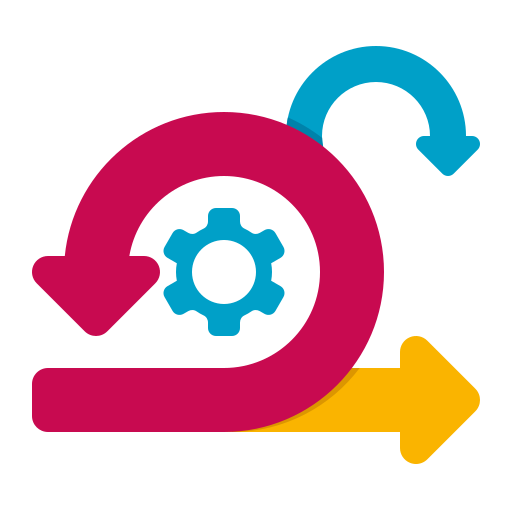

### Good time of the day, I'am Ievgen 👋

<h2>Few details about me:</h2>

- 🔭 I am <strong>Front End Developer </strong>
- 👯 I’m looking forward to applying my knowledges of <strong>HTML5, CSS3, JavaScript and React.js</strong>
- 📫 How to reach me: <strong>ievgen.tovtin@gmail.com</strong>
<!-- >- 🌱 I’m currently studying <strong>LitElement</strong><-->

<h2>Tech:</h2>

<!-- >

<-->

<!-- >

<!-->

